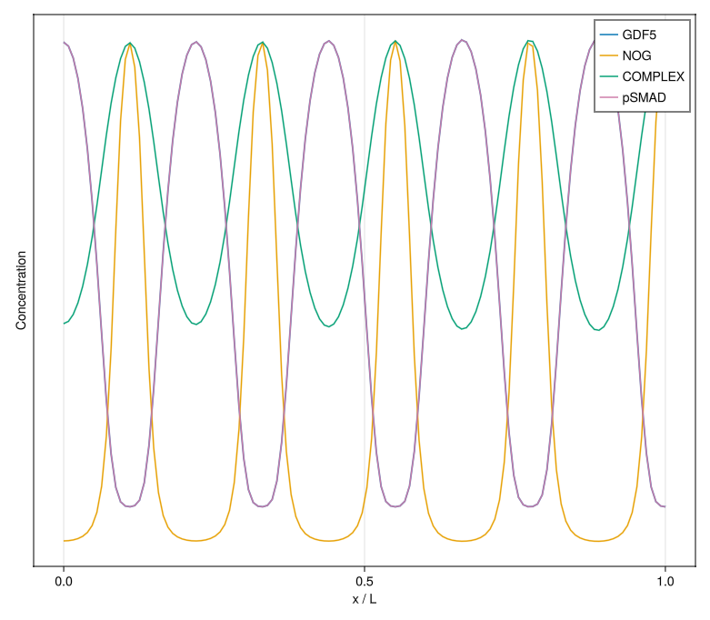
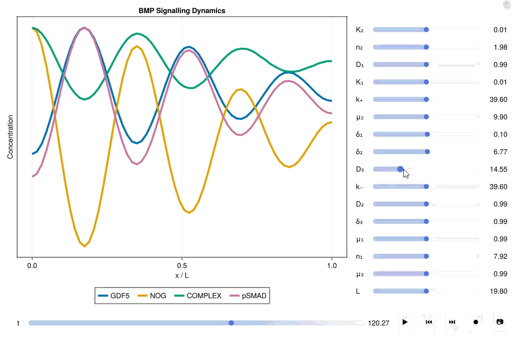

<picture>
  <source media="(prefers-color-scheme: dark)" srcset="docs/src/assets/banner-dark.svg">
  <source media="(prefers-color-scheme: light)" srcset="docs/src/assets/banner.svg">
  
</picture>


[](https://hiscocklab.github.io/ReactionDiffusion.jl/stable)
[](https://hiscocklab.github.io/ReactionDiffusion.jl/dev)

Reaction-diffusion dynamics are present across many areas of the physical and natural world, and allow complex spatiotemporal patterns to self-organize *de novo*. ReactionDiffusion.jl aims to be an easy-to-use and performant pipeline to simulate reaction-diffusion PDEs of arbitrary complexity, with a focus on pattern formation in biological systems. Leveraging computational approaches from [Catalyst.jl](https://github.com/SciML/Catalyst.jl), [Symbolics.jl](https://github.com/JuliaSymbolics/Symbolics.jl), [ModelingToolkit.jl](https://github.com/SciML/ModelingToolkit.jl), and [DifferentialEquations.jl](https://github.com/SciML/DifferentialEquations.jl), ReactionDiffusion.jl enables complex, biologically-inspired reaction-diffusion models to be:
- specified using an intuitive, easy-to-understand syntax
- screened across millions of parameter combinations to identify pattern-forming networks (i.e., those that undergo a Turing instability)
- rapidly simulated to predict spatiotemporal patterns

## Tutorials and documentation

Documentation and worked examples for ReactionDiffusion.jl can be found in the [stable
documentation](https://hiscocklab.github.io/ReactionDiffusion.jl/stable/). The [in-development
documentation](https://hiscocklab.github.io/ReactionDiffusion.jl/dev/) describes unreleased features in
the current master branch.

## Illustrative example

Here we show how ReactionDiffusion.jl can be used to quickly simulate a biologically-inspired reaction-diffusion system that is responsible for generating evenly spaced joints along the length of your fingers and toes (from [Grall et el, 2024](https://www.pnas.org/doi/10.1073/pnas.2304470121)).

#### Step 1: Specify complex reaction-diffusion models with intuitive, easy-to-understand code

We begin by specifying the reaction-diffusion dynamics via the intuitive syntax developed in [Catalyst.jl](https://github.com/SciML/Catalyst.jl), which naturally mirrors biochemical feedbacks and interactions.

```julia
using ReactionDiffusion

reaction = @reaction_network begin
    # complex formation
    (k₊, k₋),               GDF5 + NOG <--> COMPLEX 
    # degradation
    δ₁,                     GDF5 --> ∅
    δ₂,                     NOG --> ∅
    δ₃,                     pSMAD --> ∅
    # transcriptional feedbacks (here: repressive hill functions)
    hillr(pSMAD,μ₁,K₁,n₁),  ∅ --> GDF5
    hillr(pSMAD,μ₂,K₂,n₂),  ∅ --> NOG
    # signalling
    μ₃*GDF5,                ∅ --> pSMAD
end

diffusion = @diffusion_system L begin
    D₁,     GDF5
    D₂,      NOG
    D₃,  COMPLEX
end

model = Model(reaction, diffusion; name="BMP Signalling Dynamics")
```

#### Step 2: Specify value(s) for each parameter

```julia
params = product(
    μ₁ = [1.0],
    μ₂ = [10.0],
    k₊ = range(10,100,10),
    k₋ = range(10,100,10),
    μ₃ = [1.0],
    δ₁ = [0.1],
    δ₂ = [6.7],
    δ₃ = [1.0],
    K₁ = [0.01],
    K₂ = [0.01],
    n₁ = [8.0],
    n₂ = [2.0],
    D₁ = [1.0],
    D₂ = [1.0],
    D₃ = [30.0],
    L  = [45.0]
)
```

#### Step 3 (Optional): Perform automated Turing instability analysis to find pattern-forming parameter sets

With a single line of code, we can perform a Turing instability analysis across all combinations of parameters:

```julia
turing_params = filter_turing(model, params);
```

This returns all parameter combinations that break symmetry from a homogeneous initial condition. We take advantage of the either the symbolic solvers in [Symbolics.jl](https://docs.sciml.ai/Symbolics) or the highly performant numerical solvers in [DifferentialEquations.jl](https://docs.sciml.ai/DiffEqDocs) to rapidly identify homogeneous steady states from which Turing instabilities can arise. 

#### Step 4: Simulate the spatiotemporal dynamics of the reaction-diffusion PDEs

We may then take a collection of interesting parameter sets and simulate their spatiotemporal dynamics directly, using [Makie.jl](https://makie.org) to visualize the resulting pattern. This model is very sensitive to small perturbations so we need to specify smaller time steps than the default to ensure numerical stability, and a fixed time span to stop the simulation terminating prematurely:

```julia
sol = simulate(model, turing_params; dt=0.01, tspan=700.0, num_verts=128)
steady_state_plot(model, sol[10], normalise=true)
```




Finally we can use the interactive visualisation tool to view the full dynamics over a range of parameter values.

```julia
interactive_plot(model, turing_params[10]; dt=0.01, num_verts=128, tspan=700.0, normalise=true)
```



## Support, citation and future developments

If you find ReactionDiffusion.jl helpful in your research, teaching, or other activities, please star the repository and consider citing [this paper](https://doi.org/10.1242/dev.205067).

We are a small team of academic researchers from the [Hiscock Lab](https://twhiscock.github.io/), who build mathematical models of developing embryos and tissues. We have found these scripts helpful in our own research, and make them available in case you find them helpful in your research too. We hope to extend the functionality of ReactionDiffusion.jl as our future projects, funding and time allows.

This work is supported by ERC grant SELFORG-101161207, and UK Research and Innovation (Biotechnology and Biological Sciences Research Council, grant number BB/W003619/1) 

*Funded by the European Union. Views and opinions expressed are however those of the author(s) only and do not necessarily reflect those of the European Union or the European Research Council Executive Agency. Neither the European Union nor the granting authority can be held responsible for them*


